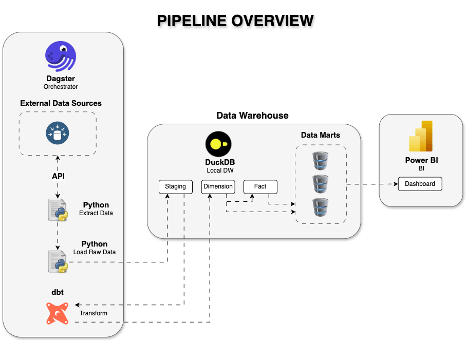
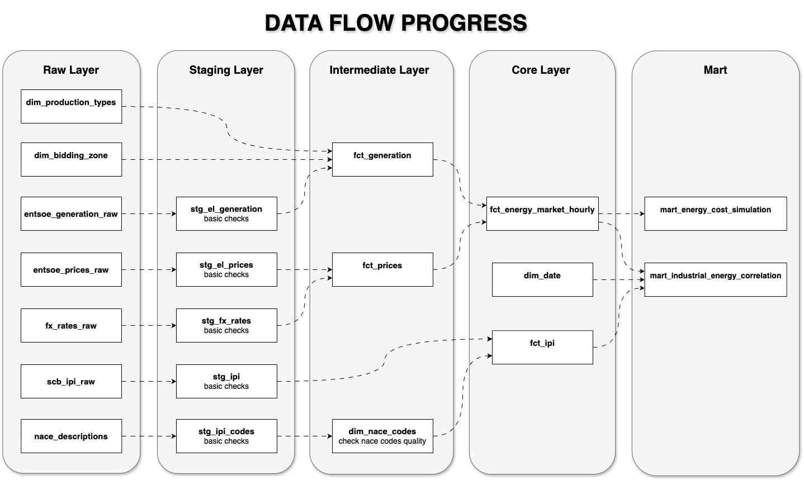
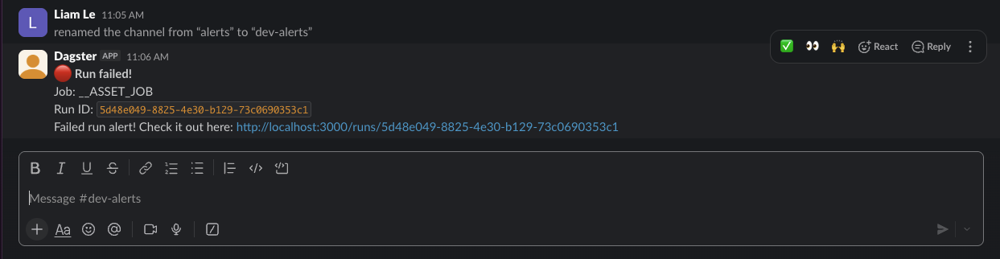
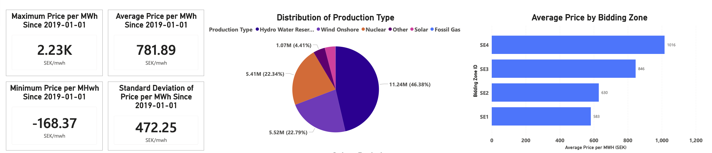

# Swedish Energy Prices Impact on Automotive Industry Data Warehouse

> End-to-End Analytics Pipeline via Dagster, dbt & DuckDB.

The following diagram illustrates the architecture of the pipeline:

## Business Context

The Nordic energy market is characterized by high volatility in electricity prices, driven by factors such as weather conditions, fuel costs, and grid constraints. For energy-intensive industries like automotive manufacturing, this volatility can lead to significant cost fluctuations and margin pressure. By building a data pipeline that ingests hourly market data, transforms it into actionable insights, and serves it through a dashboard, we can help manufacturers optimize their energy procurement strategies, identify cost-saving opportunities, and ultimately improve their financial performance in a competitive market.

## Live Dashboard
The production BI layer is fully open-source and automatically deployed via version-controlled code. The live dashboard is interacted with the live charts, filter by industrial sectors, and run energy cost simulations directly in the browser:

**[Access the Live Evidence.dev Dashboard]()**

## Architecture

The pipeline follows a modern **ELT** pattern: 

1. **Ingestion (Extract & Load)**: 

Python + Dagster fetches hourly data from APIs, reshapes it (Wide to Long), and loads it into DuckDB Raw schema. There is light transformation at this stage to ensure data is in a queryable format, but the core business logic is reserved for dbt.

2. **Transformation (Transform)**: 

dbt takes over to clean, join, and model the data into Staging, Intermediate, and Mart layers.

3. **Orchestration**: 

Dagster coordinates the entire flow, ensuring dbt runs only after successful ingestion. The pipeline is designed to be modular, scalable, and maintainable, allowing for easy addition of new data sources or transformation logic as business needs evolve.

## Data Lineage & Layers
Below is the end-to-end data flow progress diagram of the DuckDB analytical warehouse:

### Layer Breakdown & Modeling Logic:

1. **Raw Layer (Bronze)**: 
   - Acts as the landing zone for immutable raw data ingested from APIs (ENTSO-E, Frankfurter, SCB) and static lookup files. 
   - *Note on `entsoe_generation_raw`*: Reshaped from wide to long format during ingestion to enforce a fixed relational schema before loading.

2. **Staging Layer (Silver - Staging)**:
   - Performs basic data health checks, deduplication, and initial casting (e.g., handling timestamps and null rows) using dbt staging models.

3. **Intermediate Layer (Silver - Intermediate)**:
   - **`fct_generation` & `fct_prices`**: Built as incremental models utilizing a `delete+insert` strategy to ensure **idempotency**. This is where exchange rates (`stg_fx_rates`) are applied to normalize all monetary values into a single currency.
   - **`dim_nace_codes`**: Validates and cleans the quality of NACE industrial classification codes.

4. **Core Layer (Gold - Core)**:
   - Establishes a centralized **Star Schema** foundation. 
   - Combines hourly electricity generation data and spot prices into a unified grain (`fct_energy_market_hourly`), mapped against industrial productivity indices (`fct_ipi`) and a standardized time dimension (`dim_date`).

5. **Mart Layer (Gold - Mart)**:
   - Exposes business-ready data products tailored directly for the serving layer (Evidence.dev).
   - **`mart_energy_cost_simulation`**: Powers the dynamic ROI calculator for factory peak-shifting scenarios.
   - **`mart_industrial_energy_correlation`**: Provides the analytical foundation to discover correlations between manufacturing output (IPI) and power grid dynamics.

## Stack
| Layer | Tool | Reason |
|---|---|---|
| Orchestration | Dagster | Coordinates partitioned hourly assets, manages retry logic, and triggers Slack alerts |
| Transformation | dbt + DuckDB | SQL-first, version-controlled modelling with a high-performance in-process OLAP warehouse |
| Serving | Evidence.dev | Code-based, Markdown+SQL driven BI layer for rapid, git-integrated dashboard deployment |
| Monitoring | Slack | Proactive, real-time alerting system linked with Dagster to minimize pipeline downtime |

## Data Sources

The warehouse ingests and blends multi-grain datasets to evaluate macro-industrial impacts against grid dynamics:

| Source | Frequency | Method |
|---|---|---|
| **ENTSO-E Transparency Platform** | Hourly | REST API - Python | Raw electricity prices and generation mix for SE3 zone. |
| **SCB Industrial Production Index** | Monthly | REST API - Python | Industrial Production Index (IPI) for manufacturing sectors. |
| **Frankfurter.dev Exchange Rates** | Daily | REST API - Python | EUR to SEK daily exchange rates for cost modeling. |
| **Manual Domain Reference Data** | Static | dbt seed - CSV | Domain-specific lookup tables: OEE proxies, unit conversions, and NACE industry codes. |

This project applies the data ingestion strategy based on Source Velocity to reach the right balance of Goldilocks of Orchestration, ensuring that data is fresh enough to be actionable without overwhelming the system with unnecessary API calls or processing overhead, while managing source-specific latencies through Dagster Sensors and Exponential Backoffs to maintain a resilient and idempotent pipeline. 

By ingesting hourly data from ENTSO-E, we can capture the volatility of electricity prices in near real-time, which is critical for accurate cost modeling and decision-making in the automotive industry. The monthly IPI data from SCB provides a macro-level view of industrial production trends, while daily exchange rates from Frankfurter.dev allow us to normalize costs into a consistent currency for analysis. This multi-grain approach ensures that our insights are both timely and contextually relevant for the target users.

## Key Design Decisions

- **ELT Architecture**: 
Separation of ingestion (Dagster) and transformation (dbt) allows for modularity and scalability. Ingestion focuses on fetching and loading raw data, while dbt handles all transformations and business logic.

- **Dagster**: Orchestrates the workflow, ensuring that data is ingested and transformed in the correct sequence. dbt handles all transformations, allowing for modular SQL development and testing. DuckDB serves as a local analytical warehouse, providing fast query performance for both dbt and the dashboard.

- **DuckDB as Warehouse**: 
DuckDB is used as a local analytical warehouse that Supports SQL and integrates well with dbt and thus is chosen for its simplicity and performance for local analytics.

- **Evidence.dev for Serving**: Evidence.dev is chosen for its seamless integration with SQL and Markdown, allowing for rapid dashboard development and deployment directly from the codebase, ensuring version control and collaboration.  

- **Proactive Monitoring**: Integration of Slack alerts with Dagster ensures that any pipeline failures are immediately communicated to the team, minimizing downtime and ensuring data reliability for decision-making.

## Monitoring & Alerting
To ensure high data availability and proactive pipeline health, I implemented a robust alerting system for failure response:
- **Integration**: Linked Dagster's default status sensors with a Slack incoming webhook.
- **Trigger**: Automated alerts are dispatched instantly whenever an ingestion asset, dbt model materialization, or a partition run fails.
- **Contextual Notifications**: Alerts include critical failure context—job name, timestamp, and direct links to Dagster logs for accelerated Mean Time To Repair (MTTR).

### Automated Failure Alert Example
Below is a real-time example of a contextual failure notification dispatched to the `#monitoring` Slack channel during a dbt run failure:

*This structured alert minimizes operational downtime by providing the on-call engineer with immediate context to begin diagnostics.*

## Dashboard Interpretation Guide

### Market Overview

**KPI Cards (top-left):**
- **Maximum Price (2.23K SEK/MWh):** Peak price recorded since 2019, occurring during morning demand surges in winter months
- **Average Price (781.89 SEK/MWh):** Long-run mean across all four bidding zones and all hours since 2019
- **Minimum Price (-168.37 SEK/MWh):** Negative prices occur during renewable oversupply periods — grid operators effectively pay consumers to absorb excess generation
- **Standard Deviation (472.25 SEK/MWh):** Represents ~60% of the average price, confirming extreme hourly volatility in the Nordic electricity market

**Electricity Price Trend (SE1-SE4):**
Four bidding zones display consistent price stratification — SE4 (South Sweden, avg 1,016 SEK/MWh) trades at a persistent premium versus SE1 (North Sweden, avg 583 SEK/MWh) due to transmission constraints and lower local hydro availability. The 74% north-south price spread is the single most important structural feature of the Swedish electricity market for industrial cost planning.

**Total Energy Production — Generation Mix:**
Hydro dominates at 46.38%, followed by Wind Onshore (22.79%) and Nuclear (22.34%). This weather-dependent renewable mix explains why Swedish electricity prices are highly seasonal — drought years reduce hydro output and drive sustained price spikes that compress manufacturing margins.

**Average Price by Bidding Zone (bar chart):**
- SE4: 1,016 SEK/MWh — highest, import-dependent southern zone
- SE3: 846 SEK/MWh — central Sweden including Stockholm
- SE2: 630 SEK/MWh — north-central, hydro-rich
- SE1: 583 SEK/MWh — lowest, northernmost hydro corridor

### Energy Cost Optimization: Peak Shifting Simulation  

**Cost Reduction Breakdown — Waterfall Chart:**
Green bars represent months where shifting 30% of flexible load to off-peak hours (bottom price percentile) yields measurable cost reduction versus the all-hour average baseline.

Red bars (2021-2022) reflect the European energy crisis period when sustained price spikes eliminated the typical peak/off-peak differential across all hours simultaneously — a market condition where load shifting becomes ineffective regardless of scheduling strategy.

**Monthly Energy Cost: Standard vs Off-Peak Shifted Operations:**
Each panel shows one bidding zone. The 2021-2022 spike is visible across all four zones, with SE3 and SE4 showing the most pronounced baseline-to-optimized gap in normal market conditions.

**Estimated Cost Saving by Bidding Zone (%):**
- SE3: 44% — highest saving potential due to pronounced intraday price spread
- SE2: 42%
- SE4: 42%
- SE1: 41%

SE3 and SE4 show higher saving potential precisely because their larger peak/off-peak spreads create more opportunity for arbitrage through flexible load scheduling.

### Industrial Correlation
**Price Sensitivity of Automotive Sector — Scatter Chart:**
Each dot represents one NACE industry sector in one calendar month, plotted against the average electricity price for that month. Three sectors are tracked:
- **NACE 28:** Machinery and equipment manufacturing
- **NACE 29:** Motor vehicles, trailers and semi-trailers  
- **NACE 29-30:** Broader transport equipment industry

Dots clustering toward the upper-left (low price, high IPI) indicate favorable production conditions. The rightward drift of clusters during 2021-2022 high-price periods is visible across all three sectors. Use the Play axis (▶ button) to animate the chart and observe how sectors shift position as market conditions change over time.

**Electricity Price vs IPI — Monthly Trend (dual-axis):**
Left axis (bars): Average monthly electricity price in SEK/MWh.
Right axis (line): Industrial Production Index (IPI, base 2021=100).

The chart covers March 2023 to March 2026. Notable observations:
- Price spikes in late 2025 (1,031-1,057 SEK/MWh) coincide with 
  IPI values declining toward 95-106 range
- Low-price periods (172-204 SEK/MWh in 2024) correspond with IPI 
  recovering toward 112-125

This pattern is consistent with the hypothesis that sustained high energy costs create headwinds for energy-intensive manufacturing output, though multiple macroeconomic factors contribute to IPI 
movements simultaneously.

### Analytical Boundaries
This dashboard presents **descriptive and diagnostic analytics** — it identifies patterns and correlations in historical data. It does not establish causation between electricity prices and industrial output, and does not constitute a forecasting or prescriptive model.

**Peak Shifting Simulation assumptions:**
- Model assumes 30% of industrial load can be shifted to the bottom price percentile hours within each month
- In practice, load shifting applies to flexible loads: compressed air systems, thermal storage, water treatment, EV fleet charging, and batch processing operations
- Assembly line and continuous production operations are excluded from load shifting assumptions
- Model assumes constant production volume — only energy consumption timing is rescheduled, not production quantity

**IPI Correlation assumptions:**
- IPI data sourced from Statistics Sweden (SCB), monthly frequency
- Electricity price data sourced from ENTSO-E Transparency Platform, hourly frequency aggregated to monthly averages
- Correlation analysis covers NACE sectors 28, 29, and 29-30 only
- IPI movements reflect multiple macroeconomic factors beyond energy costs including global demand cycles, supply chain conditions, and seasonal production patterns

## Definition of Done
- [x] **Data Ingestion**: Hourly data from ENTSO-E, SCB, and Frankfurter APIs is successfully ingested into DuckDB with appropriate transformations (e.g., wide to long for generation data).
- [x] **Data Modeling**: dbt models are implemented across Staging, Intermediate, Core, and Mart layers, with clear lineage and documentation.
- [x] **Data Quality Enforced**: 100% of dbt schema and data quality tests pass on every deployment.
- [x] **Idempotency Verified**: Destructive pipeline retries yield identical data volume and metrics.
- [x] **Automated Observability**: Source freshness monitors and active Slack alerting webhooks configured.
- [x] **Production Serving**: Dashboard snapshot is successfully obtained and included in this repository.

