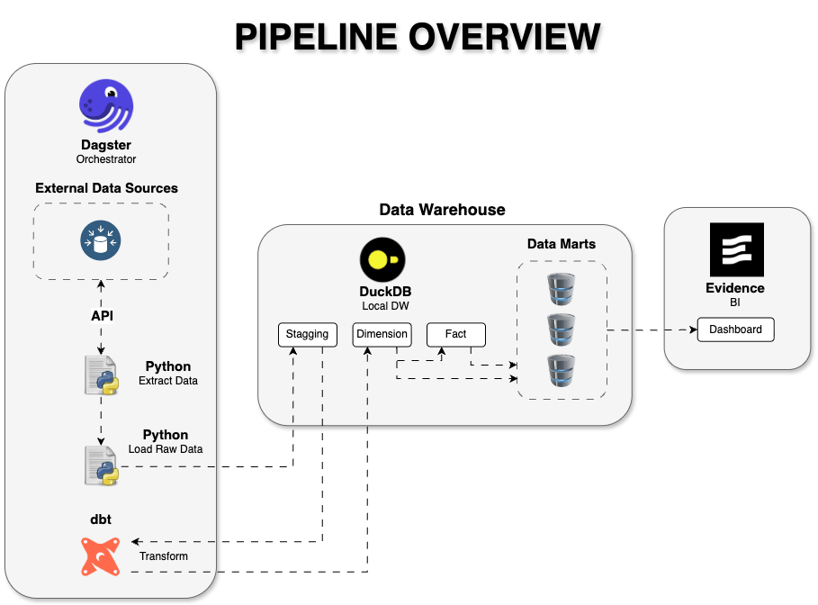
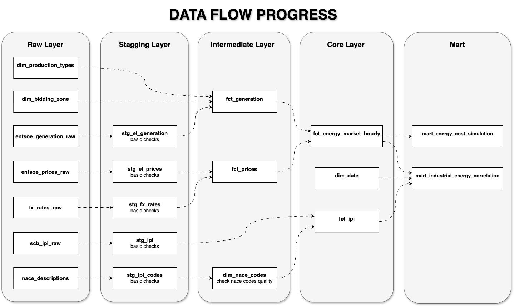

# Swedish Energy Prices and Automotive Industry Analytics

> End-to-end analytics pipeline combining hourly ENTSO-E to model energy cost exposure for Swedish industrial manufacturers.
> An end-to-end Analytics Pipeline correlating Nordic electricity price volatility (SE3) with the Swedish automotive supply chain index to model and optimize industrial energy cost exposure.

## Business Context

The Nordic energy market is characterized by high volatility in electricity prices, driven by factors such as weather conditions, fuel costs, and grid constraints. For energy-intensive industries like automotive manufacturing, this volatility can lead to significant cost fluctuations and margin pressure. By building a data pipeline that ingests hourly market data, transforms it into actionable insights, and serves it through a dashboard, we can help manufacturers optimize their energy procurement strategies, identify cost-saving opportunities, and ultimately improve their financial performance in a competitive market.

## Live Dashboard
The production BI layer is fully open-source and automatically deployed via version-controlled code.
**[Access the Live Evidence.dev Dashboard]()**

## Architecture

The pipeline follows a modern **ELT** pattern: 

1. **Ingestion (Extract & Load)**: 

Python + Dagster fetches hourly data from APIs, reshapes it (Wide to Long), and loads it into DuckDB Raw schema. There is light transformation at this stage to ensure data is in a queryable format, but the core business logic is reserved for dbt.

2. **Transformation (Transform)**: 

dbt takes over to clean, join, and model the data into Staging, Intermediate, and Mart layers.

3. **Orchestration**: 

Dagster coordinates the entire flow, ensuring dbt runs only after successful ingestion. The pipeline is designed to be modular, scalable, and maintainable, allowing for easy addition of new data sources or transformation logic as business needs evolve.

The following diagram illustrates the architecture of the pipeline:




## Data Lineage & Layers
Below is the end-to-end data flow progress diagram of the DuckDB analytical warehouse:



### Layer Breakdown & Modeling Logic:

1. **Raw Layer (Bronze)**: 
   - Acts as the landing zone for immutable raw data ingested from APIs (ENTSO-E, Frankfurter, SCB) and static lookup files. 
   - *Note on `entsoe_generation_raw`*: Reshaped from wide to long format during ingestion to enforce a fixed relational schema before loading.

2. **Staging Layer (Silver - Staging)**:
   - Performs basic data health checks, deduplication, and initial casting (e.g., handling timestamps and null rows) using dbt staging models.

3. **Intermediate Layer (Silver - Intermediate)**:
   - **`fct_generation` & `fct_prices`**: Built as incremental models utilizing a `delete+insert` strategy to ensure **idempotency**. This is where exchange rates (`stg_fx_rates`) are applied to normalize all monetary values into a single currency.
   - **`dim_nace_codes`**: Validates and cleans the quality of NACE industrial classification codes.

4. **Core Layer (Gold - Core)**:
   - Establishes a centralized **Star Schema** foundation. 
   - Combines hourly electricity generation data and spot prices into a unified grain (`fct_energy_market_hourly`), mapped against industrial productivity indices (`fct_ipi`) and a standardized time dimension (`dim_date`).

5. **Mart Layer (Gold - Mart)**:
   - Exposes business-ready data products tailored directly for the serving layer (Evidence.dev).
   - **`mart_energy_cost_simulation`**: Powers the dynamic ROI calculator for factory peak-shifting scenarios.
   - **`mart_industrial_energy_correlation`**: Provides the analytical foundation to discover correlations between manufacturing output (IPI) and power grid dynamics.


## Stack
| Layer | Tool | Reason |
|---|---|---|
| Orchestration | Dagster | Coordinates partitioned hourly assets, manages retry logic, and triggers Slack alerts |
| Transformation | dbt + DuckDB | SQL-first, version-controlled modelling with a high-performance in-process OLAP warehouse |
| Serving | Evidence.dev | Code-based, Markdown+SQL driven BI layer for rapid, git-integrated dashboard deployment |
| Monitoring | Slack | Proactive, real-time alerting system linked with Dagster to minimize pipeline downtime |


## Data Sources

The warehouse ingests and blends multi-grain datasets to evaluate macro-industrial impacts against grid dynamics:

| Source | Frequency | Method |
|---|---|---|
| **ENTSO-E Transparency Platform** | Hourly | REST API - Python | Raw electricity prices and generation mix for SE3 zone. |
| **SCB Industrial Production Index** | Monthly | REST API - Python | Industrial Production Index (IPI) for manufacturing sectors. |
| **Frankfurter.dev Exchange Rates** | Daily | REST API - Python | EUR to SEK daily exchange rates for cost modeling. |
| **Manual Domain Reference Data** | Static | dbt seed - CSV | Domain-specific lookup tables: OEE proxies, unit conversions, and NACE industry codes. |


## Key Design Decisions

- **ELT Architecture**: 
Separation of ingestion (Dagster) and transformation (dbt) allows for modularity and scalability. Ingestion focuses on fetching and loading raw data, while dbt handles all transformations and business logic.

- **Dagster**: Orchestrates the workflow, ensuring that data is ingested and transformed in the correct sequence. dbt handles all transformations, allowing for modular SQL development and testing. DuckDB serves as a local analytical warehouse, providing fast query performance for both dbt and the dashboard.

- **DuckDB as Warehouse**: 
DuckDB is used as a local analytical warehouse that Supports SQL and integrates well with dbt and thus is chosen for its simplicity and performance for local analytics.

- **Evidence.dev for Serving**: Evidence.dev is chosen for its seamless integration with SQL and Markdown, allowing for rapid dashboard development and deployment directly from the codebase, ensuring version control and collaboration.  

- **Proactive Monitoring**: Integration of Slack alerts with Dagster ensures that any pipeline failures are immediately communicated to the team, minimizing downtime and ensuring data reliability for decision-making.


## Definition of Done
- [x] 100% dbt tests pass 
- [x] Idempotent ingestion process
- [x] Source freshness monitoring configured
- [x] Live dashboard deployed at


## How to Run
### Prerequisites
- **Python 3.12+** (managed via `uv`)
- **Node.js 22+** (required for the Evidence.dev compiler)

### 1. Clone & Environment Setup
Clone the repository and install the unified dependencies for both the data pipeline and the frontend dashboard:
```bash
# Clone the repository
git clone <your-repo-url>
cd NordEnergy-Auto-Pipeline

# Install Python packages and setup virtual environment via uv
uv sync

# Install frontend BI dependencies
cd dashboard
npm install

